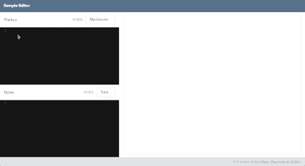

# [Sample Editor](http://swashcap.github.io/sample-editor/)

This is a HTML/Markdown and CSS/Sass live editor. It’s build using [React.js](https://facebook.github.io/react/) and [Facebook’s Flux.js](https://facebook.github.io/react/). Sass compilation is accomplished through a [Sass.js](https://github.com/medialize/sass.js/) web worker, and Markdown compilation is done through a custom web worker with [markdown.js](https://github.com/evilstreak/markdown-js). Oh, and the project is built with [Webpack](http://webpack.github.io/).

This was done as a quick little exploration. The architecture is rather crude, and the error notifications are pretty annoying. But, hey! learning.

Check out the bundled version: **<http://swashcap.github.io/sample-editor/>**.
